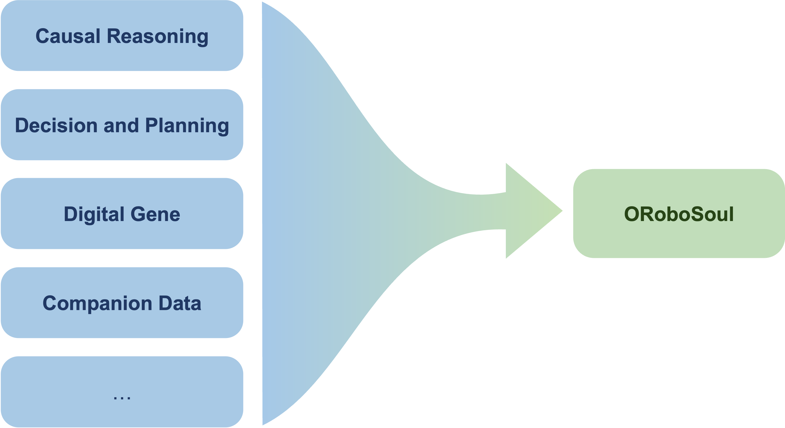
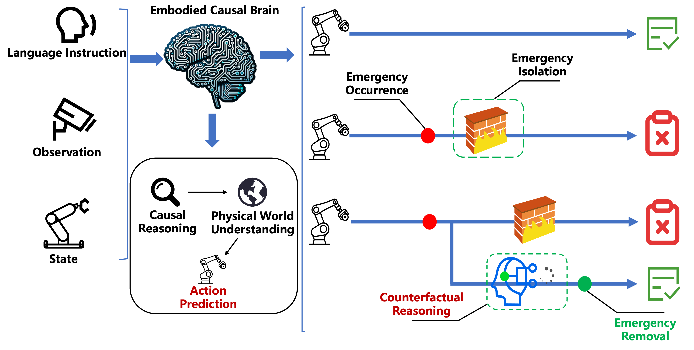
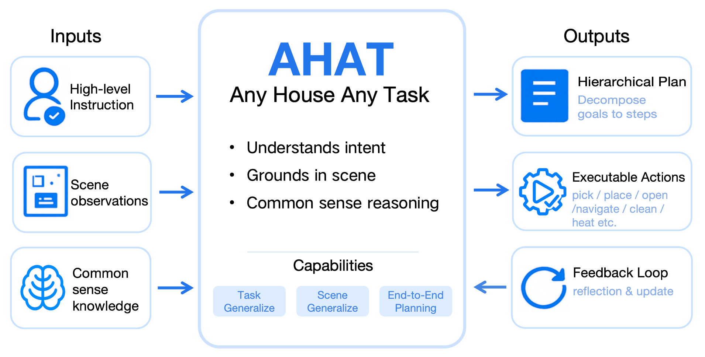

# ORoboSoul: General Embodied Brain Research
**Unified digital gene and representation systems, large foundation models, and collaborative system evolution**

## ⭐️ Projects

Repository | Description
---- | ----
[Digital Gene](https://github.com/sii-research/DigitalGene)			| Brief Description 
[End-to-end Causal Reasoning and Closed-loop Interactive Learning](https://github.com/sii-research/ORoboSoul/tree/causal-robot/causal-robot) | Safe and robust robotic action with causal reasoning
[Embodied Companion: Data and Representation](https://github.com) | Complex manipulation skills directly from human demonstration
[IL-Studio: One-stop Platform for Imitation Learning Data](https://github.com/WwZzz/IL-Studio) | A plug-and-Play imitation-learning playground for robotics
[Commonsense Embodied Decision-making](https://github.com/sii-research/ORoboSoul/tree/feature/decision-making/decision-making#readme) | Any House Any Task embodied planning model

Digital Gene

Details

End-to-end Causal Reasoning and Closed-loop Interactive Learning

  

Enabling intelligent systems—especially robots—by not only perceiving and acting, but also understanding causal relations, making safer and more robust decisions, and continually refining their knowledge through real-world interactions

Embodied Companion: Data and Representation

Embodied Companion builds large-scale human–robot companion data and unified representations to transfer everyday human manipulation into robot-executable skills, empowering downstream VLA models.

IL-Studio: One-stop Platform for Imitation Learning Data

IL-Studio is an open-source repository that lets researchers and engineers jump-start imitation-learning experiments on popular robot manipulation benchmarks with minimal friction. The entire training, evaluation, and deployment pipeline has been carefully modularized so that you can swap-in your own policy, environment, or dataset without touching the rest of the stack.

Commonsense Embodied Decision-making

Commonsense Embodied Decision-making is an open-source research framework for embodied AI, aimed at enabling intelligent agents, such as robots, to leverage commonsense knowledge like humans to understand complex instructions and make decisions.

  

AHAT (Any House Any Task) is an end-to-end Large Language Model (LLM) to serve as the agent's reasoning and decision-making core.

