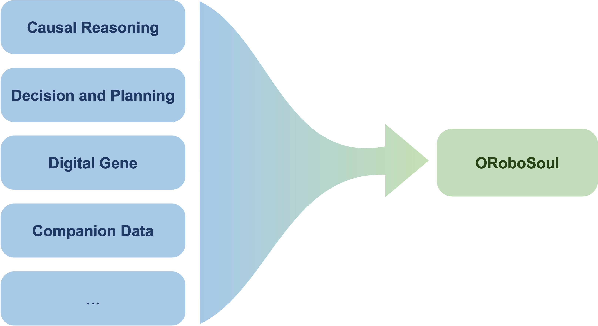

# ORoboSoul: General Embodied Brain Research
**Unified digital gene and representation systems, large foundation models, and collaborative system evolution**

        </a>&nbsp&nbsp⭐️ <a href="https://github.com/">Project</a></a>&nbsp&nbsp | &nbsp&nbsp🤗 <a href="https://huggingface.co">Hugging Face</a>&nbsp&nbsp | &nbsp&nbsp🤖 <a href="https://www.modelscope.cn">ModelScope</a>&nbsp&nbsp | &nbsp&nbsp📑 <a href="http://arxiv.org">Paper</a>&nbsp&nbsp | &nbsp&nbsp💬 <a href="./assets/wechat.png">WeChat</a>

## ⭐️ Projects

Repository | Description
---- | ----
[Digital Gene](https://github.com/sii-research/DigitalGene)			| Brief Description 
[End-to-end Causal Reasoning Closed-loop Interactive Learning](https://github.com/sii-research/ORoboSoul/tree/causal-robot/causal-robot/README.md) | Safe and robust robotic action with causal reasoning
[Synthesis and Characterization of Associated Embodied Data](https://github.com) | Brief Description
[Embodied Companion: Data and Representation](https://github.com) | Complex manipulation skills directly from human demonstration
[IL-Studio: One-stop Platform for Imitation Learning Data](https://github.com) | Brief Description
[Commonsense Embodied Decision-making](https://github.com) | Brief Description
[OpenEAI-Platform: Open-source Embodied Artificial Intelligence Hardware-Software Unified Platform](https://github.com/sii-research/ORoboSoul/tree/openeai-platform/README.md) | One stop open source for embodied foundational model hardware and software

Digital Gene

Details

End-to-end Causal Reasoning Closed-loop Interactive Learning

  

 
Enabling intelligent systems—especially robots—by not only perceiving and acting, but also understanding causal relations, making safer and more robust decisions, and continually refining their knowledge through real-world interactions

Embodied Companion: Data and Representation

builds large-scale human–robot companion data and unified representations to transfer everyday human manipulation into robot-executable skills, empowering downstream VLA models.

IL-Studio: One-stop Platform for Imitation Learning Data

Details

Commonsense Embodied Decision-making

Details

## 📆 Todo
