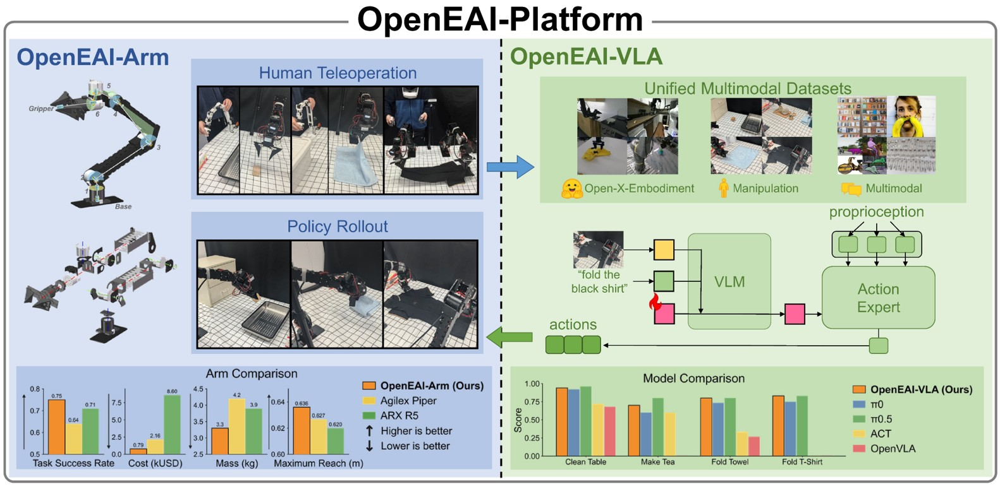

# OpenEAI-Platform: An Open-source Embodied Artificial Intelligence Hardware-Software Unified Platform

This repository provides the official (open-source) implementation for our paper: OpenEAI-Platform, a reproducible hardware–software stack for real-world embodied manipulation. OpenEAI-Platform aims to lower the barrier for building, reproducing, and scaling real-world Embodied AI systems by releasing the complete pipeline—from robot hardware designs and low-level control to data collection, dataset processing, two-stage VLA training, and deployment interfaces.

This platform currently consists of two repositories:

## ⭐️ Repository | Description

Repository | Description
---- | ----
[OpenEAI-ARM](https://github.com/eai-yeslab/OpenEAI-Arm)			| Open source robotic arm system
[OpenEAI-VLA](https://github.com/eai-yeslab/OpenEAI-VLA)      | Open source VLA including data preprocessing, VLA network, inference etc

## License

Licensed under the BSD-3-Clause License.

## Contact / Issues

If you have questions, suggestions, or would like to contribute:

- Please open an issue or submit a pull request.
- Send an e-mail to ynylincoln@sjtu.edu.cn
