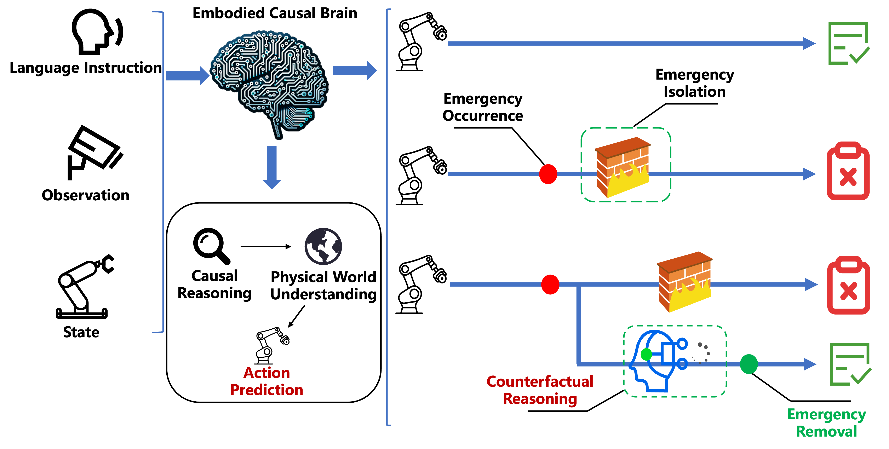

# End-to-End Causal Reasoning Closed-loop Interactive Learning

<div align="center">
  
</div>

## Overview
This project explores **end-to-end causal reasoning** within a **closed-loop interactive learning** framework.  
Our aim is to enable intelligent systems—especially robots—to not only perceive and act, but also to **understand causal relations**, make safer and more robust decisions, and continually refine their knowledge through real-world interactions.

Key features:
- **Causal Reasoning**: Moving beyond correlation to explain *why* things happen.  
- **Closed-loop Interaction**: Acting, observing feedback, and adapting in real time.  
- **Safety & Robustness**: Building **firewalls** for dangerous situations and ensuring **resilience against interference**.  
- **End-to-end Integration**: From perception to reasoning to action, all in a unified pipeline.  

## Research Goals
- Develop robots capable of **safe, controllable, and robust actions** through causal reasoning.  
- Build a scalable framework that combines **vision, language, and action** in a closed-loop setting.  
- Explore applications in **robotic manipulation, human–AI collaboration, and autonomous decision-making**.  


## Milestones

- [X] Achieve Fundamental Object Manipulation – Implement and validate simple, reliable object operation skills.
- [X] Demonstrate Robustness Against Disturbances – Ensure stable performance under external interference.
- [X] Enable Emergency Stopping – Integrate immediate halt mechanisms for hazardous situations.
- [ ] Develop Hazard Handling and Recovery – Equip the system to address risks and safely resume task execution.
- [ ] Reach Generalizable Task Execution – Extend capabilities to perform a wide range of tasks across different environments.


---

## Demo 📺


👉 *A placeholder for showcasing real-world experiments and results.*  


<!-- ## Project Structure -->
<!-- - `src/` – Core source code for causal reasoning modules  
- `data/` – Sample datasets and preprocessing scripts  
- `docs/` – Technical documentation and research notes  
- `scripts/` – Training, evaluation, and visualization tools   -->


<!-- ## Citation
If you find this project useful for your research, please cite:  
```bibtex
@article{end2end_causal_learning,
  title={End-to-End Causal Reasoning Closed-loop Interactive Learning},
  author={Your Team},
  journal={Research Project},
  year={2025}
} -->