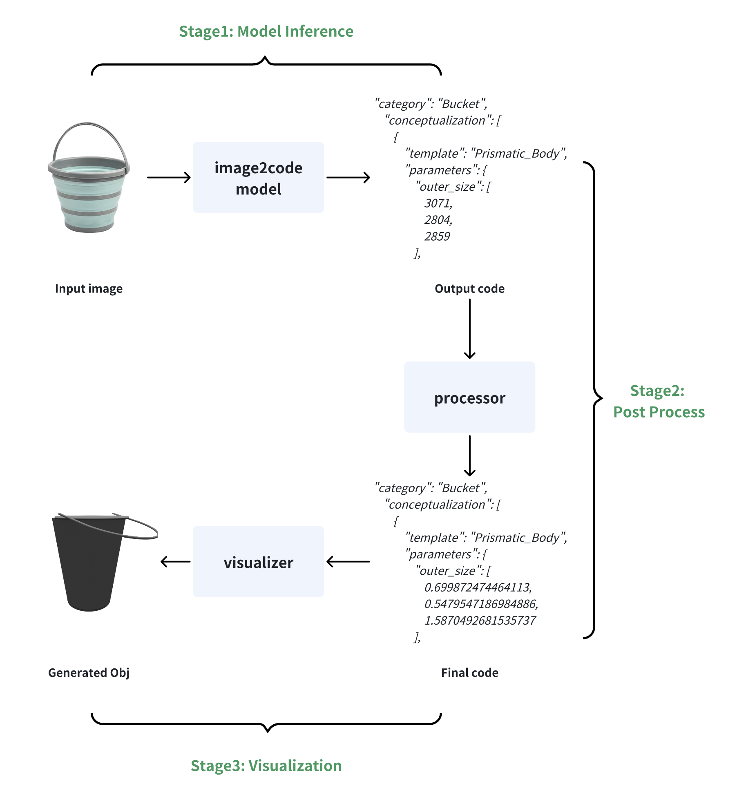

# Image to Code

An AI-powered system that analyzes images of objects and generates structured JSON representations of their geometric properties, dimensions, and parameters. This project uses vision-language models (specifically Qwen2.5-VL) to understand object characteristics and output parametric representations suitable for 3D modeling or object analysis.

You can download the model from huggingface **👉 [sii-research/digitalgene](https://huggingface.co/collections/sii-research/digitalgene-686a708500f08227013200ea)**

## ✨ Features

- **Multi-modal Analysis**: Combines visual understanding with language reasoning to analyze object properties
- **Parametric Output**: Generates structured JSON with discretized parameters (range: 2048-3072)
- **Multi-category Support**: Handles various object categories (Mug, Bottle, Box, Bucket, etc.)
- **Distributed Processing**: Supports multi-GPU inference for large-scale processing
- **Flexible Deployment**: Offers both standalone inference and client-server architecture
- **Batch Processing**: Efficient processing of multiple images simultaneously
- **Constraint Decoding**: Optional algorithm-level constraint validation to ensure well-formed JSON output

## 🔧 How It Works

The image-to-code generation process consists of two main stages:



### 🧠 Stage 1: Model Inference
The vision-language model analyzes the input image and performs multi-modal reasoning to understand:
- Object identification and classification
- Geometric structure analysis
- Parameter estimation based on visual cues
- Spatial relationships and proportions

During this stage, the model generates discretized parameter values in the range 2048-3072, which serve as intermediate representations that preserve relative relationships while being suitable for token-based processing.

### ⚙️ Stage 2: Post Processing
The discretized values are then converted back to meaningful measurements through:
- Statistical normalization using pre-computed dataset statistics
- Parameter recovery algorithms that map tokens back to real-world dimensions
- Validation and refinement of the generated parameters
- Final JSON structure formatting

This two-stage approach ensures both accuracy in understanding complex visual scenes and precision in generating usable parametric representations.

## 📁 Repository Structure

```
image-to-code-open-source/
├── example_images/          # Sample images for testing
│   ├── chair.png
│   ├── laptop.png
│   ├── mug.png
│   └── ...
├── inference/              # Basic inference scripts and client
│   ├── client.py           # HTTP client for inference service
│   ├── example.py          # Simple inference example
│   ├── param_dims.py       # Parameter dimension definitions
│   └── server.py           # HTTP inference server
├── tokenizer/              # Tokenizer and processor utilities
│   ├── processing_qwen2_5_vl.py
│   └── tokenizer.py
└── workflow/               # Advanced distributed inference
    ├── workflow.py         # Main distributed processing script
    └── utils/              # Core utilities
        ├── inference.py    # Inference functions
        ├── param_dims.py   # Parameter definitions
        ├── processor.py    # Parameter processing
        ├── prompt.py       # Prompt templates
        └── qwen_hf.py      # Model wrapper
```

## 🛠️ Installation

### 📋 Prerequisites

- Python 3.11
- PyTorch with CUDA support (for GPU inference)
- Transformers library

### 📦 Dependencies

Install required packages:

```bash
pip install torch torchvision pillow tqdm requests
pip install qwen-vl-utils  # For Qwen vision utilities
```

**Important**: This project requires a specific version of transformers with custom modifications:

1. Install transformers-4.49.0 from source:
```bash
git clone https://github.com/huggingface/transformers.git
cd transformers
git checkout v4.49.0
pip install -e .
```

2. Replace the default tokenizer files with the custom ones from this repository:
```bash
# Replace these files:
cp tokenizer/processing_qwen2_5_vl.py /path/to/transformers/src/transformers/models/qwen2_5_vl/processing_qwen2_5_vl.py
cp tokenizer/tokenizer.py /path/to/transformers/src/transformers/models/qwen2/tokenization_qwen2.py
```

**Note**: The custom tokenizer files in the `tokenizer/` directory contain modifications necessary for proper operation with this image-to-code system. Make sure to back up the original files before replacing them.

## 🚀 Usage

### 🖼️ 1. Simple Inference (Single Image)

**File**: `inference/example.py`

This script demonstrates basic single-image inference. Edit the script to set your model path, image path, and object category, then run:

```bash
cd inference
python example.py
```

The script will load the model, process your image, and output a structured JSON representation of the detected object.

### 🌐 2. Client-Server Architecture

**Server**: `inference/server.py`  
**Client**: `inference/client.py`

For production deployments or when you need to process images from multiple sources:

1. Start the inference server:
```bash
cd inference
python server.py --port 8000
```

2. Send requests using the client:
```bash
python client.py
```

Edit `client.py` to specify your image path and category. The client sends images as base64-encoded data to the server and receives JSON results.

### 🖥️ 3. Distributed Processing (Multiple GPUs)

**File**: `workflow/workflow.py`

For large-scale batch processing with complete end-to-end pipeline:

```bash
cd workflow
python workflow.py \
    --model_path /path/to/your/model \
    --test_set_dir /path/to/test/images \
    --stats_dir /path/to/stats \
    --save_dir outputs \
    --num_gpus 8
```

This script implements the complete two-stage pipeline:

**Stage 1 - Parallel Reasoning:**
- Distributes images across multiple GPUs automatically
- Each GPU processes its assigned images independently
- Generates discretized parameters (2048-3072 range) in parallel
- Saves intermediate results as `generated_code_before_rec.json`

**Stage 2 - Post-processing:**
- Automatically runs after parallel inference completes
- Loads statistical data from `--stats_dir` for parameter recovery
- Converts discretized values to real-world measurements
- Generates final results as `generated_code.json`

**Key Parameters:**
- `--test_set_dir`: Directory with categorized image folders
- `--stats_dir`: Statistical data required for post-processing stage
- `--save_dir`: Output directory for both intermediate and final results
- `--num_gpus`: Number of GPUs for parallel reasoning stage

## 🔬 Advanced Features

### 🔒 Constraint Decoding (Optional)

**File**: `workflow/utils/constraint_generation.py`

For applications requiring guaranteed valid JSON output, the repository includes an optional constraint decoding implementation. This feature enforces structural constraints at the algorithm level during generation to ensure the output always conforms to **valid JSON format**.

**Benefits:**
- Guarantees well-formed JSON structure
- Prevents malformed parameter sequences
- Ensures compliance with predefined schemas
- Reduces post-processing errors

**Trade-offs:**
- Slower inference speed
- Higher computational overhead
- May limit model creativity in parameter generation

**Usage:**
Currently not integrated into `workflow.py`. To use constraint decoding, you can integrate it into your custom inference pipeline as follows:

```python
from param_dims import param_dims
from workflow.utils.constraint_generation import ConstrainedGenerator

# Initialize available categories
categories: list = [key for key in param_dims.keys()]
print(f"categories: {categories}")

# Initialize constraint generator
generator: ConstrainedGenerator = ConstrainedGenerator(model_path, categories, param_dims)
print("Constraint generator initialized")

# Prepare inputs
category = ""
image_path = ""
instruction = f"Inspect the image, classify the '{category}' object, and return its size, shape, and position in a structured JSON format."
instruction += f"\nValid Concepts of {category}: " + ", ".join(param_dims[category].keys())

# Generate with constraints
generated_text = generator.generate(instruction, image_path, DETAILED_PROMPT)
print(f"Generated: {generated_text}")
```

This approach ensures the output strictly follows the predefined parameter structure for each category.

## 🏷️ Supported Object Categories

The system supports various object categories, each with specific parameter definitions:

- **Mug**: Multi-level body, prismatic body, handle configurations
- **Bottle**: Neck, body, cap parameters
- **Box**: Dimensions, corner properties
- **Bucket**: Body geometry, handle specifications
- **Chair**: Seat, backrest, leg configurations
- **Table**: Surface, leg arrangements
- **And many more...**
